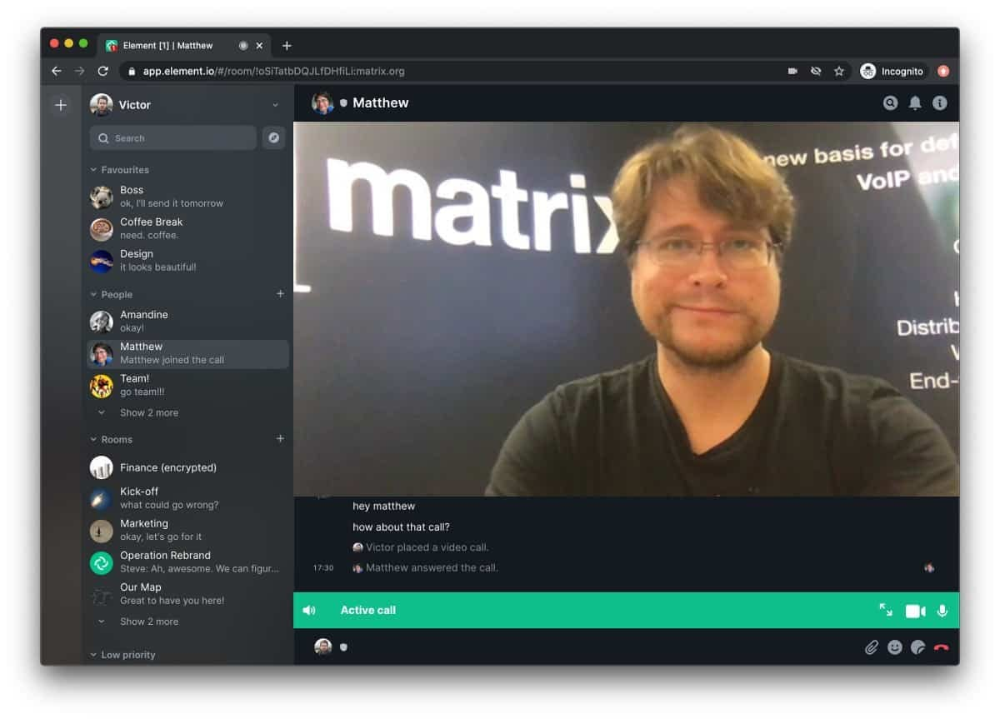

# Element CI/CD pipeline

Deploy Element server with CI/CD on Elestio

 
 

# Once deployed ...

You can open Element UI here:

    URL: https://[CI_CD_DOMAIN]
    login: admin
    password: [ADMIN_PASSWORD]

You can open pgAdmin here:

    URL: https://[CI_CD_DOMAIN]:33374
    login: [ADMIN_EMAIL]
    password: [ADMIN_PASSWORD]

# Custom domain instructions (IMPORTANT)

By default, we establish a CNAME on the elestio.app domain. However, you may prefer to use your own domain. In that case, please follow the steps outlined below.

Step1: Add your domain in Elestio dashboard as explained here: 
    
    https://docs.elest.io/books/security/page/custom-domain-and-automated-encryption-ssltls 
    
Once you have successfully incorporated the domain in the user interface (UI), it is imperative to include it in the pertinent configuration files essential for the functionality of this service.

Step2:  To accomplish this task, launch Visual Studio Code (VS Code) through the tools tab within your service details. Proceed by finding and replacing our default CNAME with your designated domain. Subsequently, execute the following commands:

Step3: Run the subsequent command  to down the current compose.
    
    docker-compose down;

Step4: Run the subsequent command to generate necessary configurations, substituting "YOUR_CUSTOM_DOMAIN" with your custom domain name:

    mv ./postgresdata ./postgresdata_old;
    mv ./synapse ./synapse_old;
    mkdir -p ./synapse
    chown -R 991:991 ./synapse
    docker run --rm -v "/opt/app/synapse:/data" -e SYNAPSE_SERVER_NAME=YOUR_CUSTOM_DOMAIN -e SYNAPSE_REPORT_STATS=yes matrixdotorg/synapse:latest generate

Step5: Finalize the process by bringing the Docker Compose back up:

    docker-compose up -d;
    ./scripts/postInstall.sh

Note: Ensure that these steps are executed in sequence to seamlessly integrate and activate your custom domain with the service.
